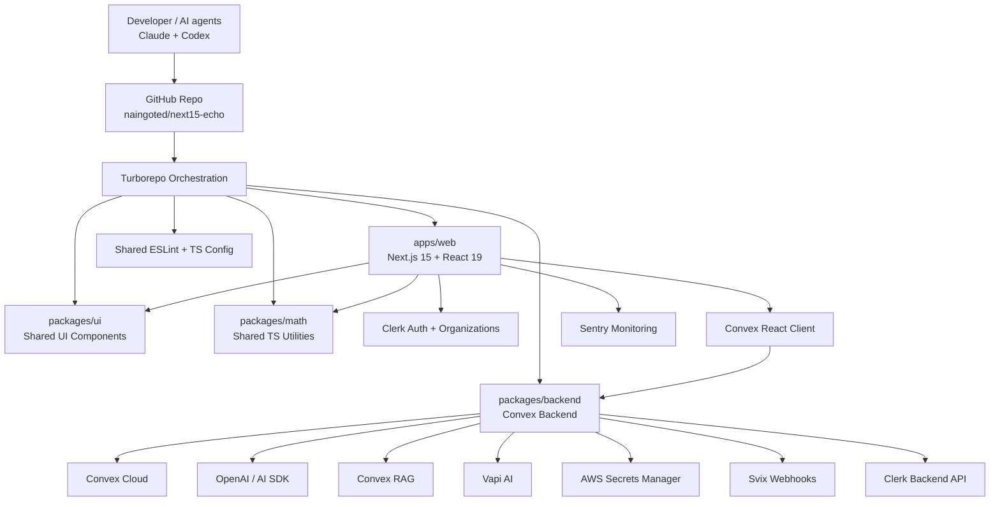
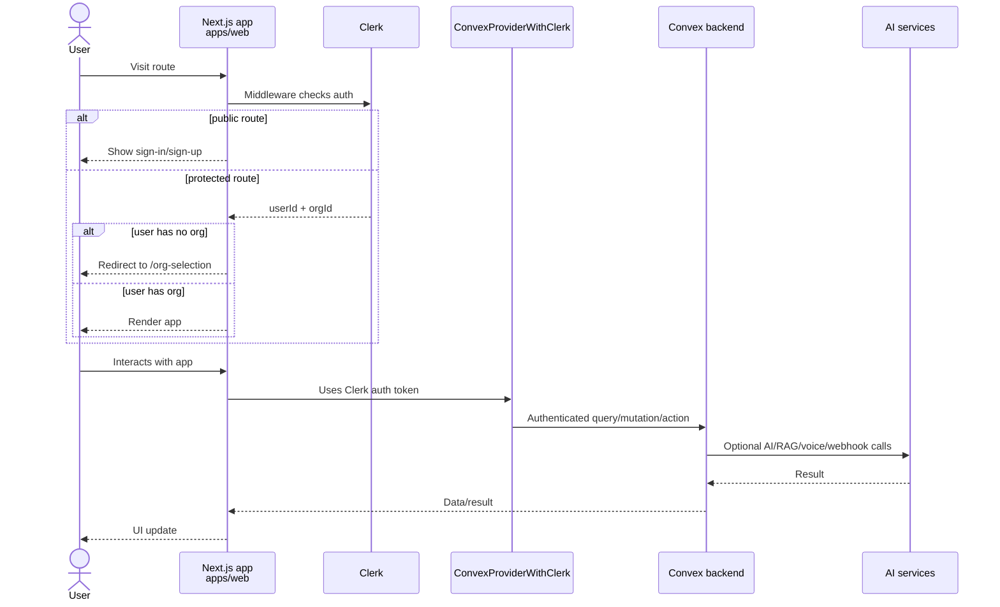
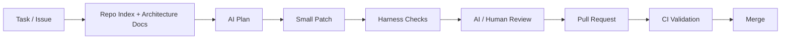
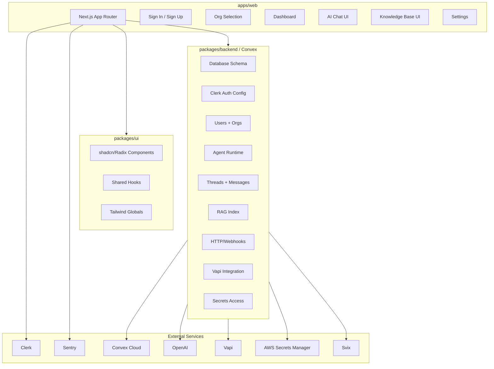

Below is a practical repo index + architecture/setup plan based on what I can access in `../next15-echo`.

## 1. What this repo currently is

This is a **pnpm + Turborepo monorepo** for a **Next.js 15 / React 19 app** with shared workspace packages.

The root workspace includes all `apps/*` and `packages/*`. 
Root scripts are Turbo-based: `pnpm dev`, `pnpm build`, `pnpm lint`, and `pnpm format`. 
The repo requires **Node >= 20** and uses **pnpm 10.4.1**. 

### Current workspace map

```txt
next15-echo/
├─ apps/
│  └─ web/                  # Next.js 15 frontend app
├─ packages/
│  ├─ backend/              # Convex backend package
│  ├─ ui/                   # shadcn/Radix/Tailwind UI package
│  ├─ math/                 # Small TS utility package
│  ├─ eslint-config/        # Shared lint config
│  └─ typescript-config/    # Shared TS config
├─ package.json
├─ pnpm-workspace.yaml
└─ turbo.json
```

## 2. High-level architecture diagram



## 3. Runtime request/auth flow



The app wraps all pages in `ClerkProvider`, then a custom `Providers` component, then the shared `Toaster`. 
`Providers` creates a `ConvexReactClient` from `NEXT_PUBLIC_CONVEX_URL` and uses `ConvexProviderWithClerk`. 
Middleware protects all non-public routes and redirects authenticated users without an org to `/org-selection`. 

## 4. Package-by-package breakdown

### `apps/web`

Main frontend app.

Key stack:

```txt
Next.js 15
React 19
Clerk auth
Convex React client
Sentry
Jotai
React Hook Form
Zod
date-fns
next-themes
shadcn/Radix UI via @workspace/ui
```

The `web` package scripts are:

```bash
pnpm --filter web dev
pnpm --filter web build
pnpm --filter web start
pnpm --filter web lint
pnpm --filter web typecheck
```

These are defined in `apps/web/package.json`. 

### `packages/backend`

Convex backend package.

Key stack:

```txt
Convex
Convex Agent
Convex RAG
Convex Agent Playground
AI SDK
OpenAI provider
Clerk backend
Vapi server SDK
AWS Secrets Manager
Svix
Zod
```

It has `convex dev` and `convex dev --until-success` scripts. 
Its dependencies show the intended backend surface: OpenAI/AI SDK, AWS Secrets Manager, Clerk, Convex Agent, Convex RAG, Vapi, Svix, and Zod. 

### `packages/ui`

Shared UI component package.

This is a shadcn/Radix-style UI library with exports for:

```txt
@workspace/ui/globals.css
@workspace/ui/lib/*
@workspace/ui/components/*
@workspace/ui/hooks/*
```

Those exports are defined in `packages/ui/package.json`. 

It includes Radix primitives, React Hook Form, Recharts, React Markdown, dropzone, command menu, toasts, Tailwind 4, and related shadcn dependencies. 

### `packages/math`

Small shared TypeScript utility package.

Currently exposes:

```txt
@workspace/math/add
@workspace/math/subtract
```

The package has `dev` and `build` scripts using TypeScript. 

## 5. External services you need to set up

Based on dependencies and current wiring, you should expect to configure these services.

### Required for the app to boot correctly

#### 1. Convex

Needed because `apps/web/components/providers.tsx` throws if `NEXT_PUBLIC_CONVEX_URL` is missing. 

You likely need:

```env
NEXT_PUBLIC_CONVEX_URL=
CONVEX_DEPLOYMENT=
```

Typical setup:

```bash
pnpm install
pnpm --filter @workspace/backend setup
```

or:

```bash
pnpm --filter @workspace/backend dev
```

#### 2. Clerk

Needed because the root layout wraps the app with `ClerkProvider`. 
Middleware also depends on Clerk auth and organizations. 

Likely env vars:

```env
NEXT_PUBLIC_CLERK_PUBLISHABLE_KEY=
CLERK_SECRET_KEY=
CLERK_WEBHOOK_SECRET=
```

Because the middleware redirects users without an `orgId`, you should enable **Clerk Organizations** in your Clerk dashboard.

### Required for planned backend/AI functionality

#### 3. OpenAI / AI SDK

The backend depends on `@ai-sdk/openai` and `ai`. 

Likely env var:

```env
OPENAI_API_KEY=
```

#### 4. Convex Agent + Convex RAG

The backend depends on `@convex-dev/agent`, `@convex-dev/agent-playground`, and `@convex-dev/rag`. 

Use this for:

```txt
AI assistant state
thread/session memory
tool execution traces
RAG document indexing
agent playground/testing
```

#### 5. Vapi

The backend depends on `@vapi-ai/server-sdk`. 

Likely env vars:

```env
VAPI_API_KEY=
VAPI_WEBHOOK_SECRET=
```

Use this only if you plan to support voice agents/calls.

#### 6. AWS Secrets Manager

The backend depends on `@aws-sdk/client-secrets-manager`. 

Likely env vars or deployment secrets:

```env
AWS_REGION=
AWS_ACCESS_KEY_ID=
AWS_SECRET_ACCESS_KEY=
```

Use this if secrets are meant to be resolved at runtime instead of stored directly in Convex/hosting env.

#### 7. Svix

The backend depends on `svix`, usually for webhook verification/delivery. 

Likely env var:

```env
SVIX_AUTH_TOKEN=
```

#### 8. Sentry

The web app depends on `@sentry/nextjs`. 

Likely env vars:

```env
NEXT_PUBLIC_SENTRY_DSN=
SENTRY_AUTH_TOKEN=
SENTRY_ORG=
SENTRY_PROJECT=
```

## 6. Feature breakdown inferred from the repo

Some of these are already structurally wired; others are implied by dependencies but still need implementation.

| Area                | Current evidence                                            | Status           |
| ------------------- | ----------------------------------------------------------- | ---------------- |
| Next.js app shell   | `apps/web` uses Next 15 + React 19                          | Present          |
| Shared UI system    | `@workspace/ui`, shadcn/Radix/Tailwind exports              | Present          |
| Auth                | `ClerkProvider` and Clerk middleware                        | Present          |
| Organization gating | Middleware checks `orgId` and redirects to `/org-selection` | Present          |
| Convex client       | `ConvexProviderWithClerk` wired in provider                 | Present          |
| Convex backend      | `packages/backend` depends on Convex and has Convex scripts | Present          |
| AI agents           | Convex Agent + AI SDK dependencies                          | Planned/inferred |
| RAG                 | Convex RAG dependency                                       | Planned/inferred |
| Voice agent         | Vapi SDK dependency                                         | Planned/inferred |
| Webhooks            | Svix + Clerk backend dependencies                           | Planned/inferred |
| Secrets management  | AWS Secrets Manager dependency                              | Planned/inferred |
| Observability       | Sentry dependency                                           | Planned/inferred |
| Charts/analytics UI | Recharts in UI package                                      | Available        |
| Markdown/chat UI    | React Markdown, remark-gfm, stick-to-bottom                 | Available        |
| Forms               | React Hook Form + Zod                                       | Available        |

## 7. Recommended local setup checklist

Create `.env.local` for the web app and appropriate Convex env vars.

```bash
git clone https://github.com/naingoted/next15-echo.git
cd next15-echo

corepack enable
pnpm install

pnpm --filter @workspace/backend setup
pnpm dev
```

Minimum env to start:

```env
# apps/web/.env.local or root .env.local depending on your convention
NEXT_PUBLIC_CONVEX_URL=

NEXT_PUBLIC_CLERK_PUBLISHABLE_KEY=
CLERK_SECRET_KEY=
```

Recommended full env template:

```env
# App
NEXT_PUBLIC_APP_URL=http://localhost:3000

# Convex
NEXT_PUBLIC_CONVEX_URL=
CONVEX_DEPLOYMENT=

# Clerk
NEXT_PUBLIC_CLERK_PUBLISHABLE_KEY=
CLERK_SECRET_KEY=
CLERK_WEBHOOK_SECRET=

# AI
OPENAI_API_KEY=

# Vapi
VAPI_API_KEY=
VAPI_WEBHOOK_SECRET=

# Svix
SVIX_AUTH_TOKEN=

# AWS Secrets Manager
AWS_REGION=
AWS_ACCESS_KEY_ID=
AWS_SECRET_ACCESS_KEY=

# Sentry
NEXT_PUBLIC_SENTRY_DSN=
SENTRY_AUTH_TOKEN=
SENTRY_ORG=
SENTRY_PROJECT=
```

## 8. Recommended “repo index” for Claude and Codex

Create a `/docs/ai/` folder that becomes the canonical context pack for AI agents.

```txt
docs/
└─ ai/
   ├─ repo-index.md
   ├─ architecture.md
   ├─ setup.md
   ├─ feature-map.md
   ├─ conventions.md
   ├─ testing-strategy.md
   ├─ agent-harness.md
   └─ prompts/
      ├─ claude-system.md
      ├─ codex-system.md
      ├─ pr-review.md
      ├─ implement-feature.md
      └─ debug-failure.md
```

### `repo-index.md`

Should include:

```md
# Repo Index

## Apps
- `apps/web`: Next.js 15 frontend app.

## Packages
- `packages/backend`: Convex backend.
- `packages/ui`: Shared UI system.
- `packages/math`: Shared TypeScript utility package.
- `packages/eslint-config`: Shared lint config.
- `packages/typescript-config`: Shared TS config.

## Common commands
- `pnpm dev`
- `pnpm build`
- `pnpm lint`
- `pnpm format`
- `pnpm --filter web typecheck`
- `pnpm --filter @workspace/backend dev`
```

### `architecture.md`

Should include the diagrams above plus rules like:

```md
- Frontend code lives in `apps/web`.
- Shared reusable components live in `packages/ui`.
- Backend data, actions, agent workflows, webhooks, and RAG live in `packages/backend`.
- Do not duplicate UI components inside `apps/web` unless they are app-specific.
- Keep external service access server-side unless a public key is explicitly required.
```

## 9. Harness engineering plan for Claude + Codex

You want a repeatable system where AI agents can safely inspect, plan, modify, test, and document changes.

### Core idea



### Add these files

```txt
AGENTS.md
CLAUDE.md
CODEX.md
docs/ai/repo-index.md
docs/ai/architecture.md
docs/ai/agent-harness.md
.github/pull_request_template.md
.github/workflows/ci.yml
```

### `AGENTS.md`

Use this as the shared instruction file for Claude, Codex, and future agents.

```md
# Agent Instructions

## Project
This is a pnpm/Turborepo monorepo with:
- `apps/web`: Next.js app
- `packages/backend`: Convex backend
- `packages/ui`: shared UI
- `packages/math`: shared utilities

## Rules
- Prefer small, reviewable changes.
- Before editing, inspect relevant files.
- Keep app-specific code in `apps/web`.
- Keep reusable UI in `packages/ui`.
- Keep backend functions, agents, webhooks, and RAG code in `packages/backend`.
- Never hardcode secrets.
- Update docs when architecture or setup changes.

## Required checks before finalizing
- `pnpm lint`
- `pnpm build`
- `pnpm --filter web typecheck`
```

### `CLAUDE.md`

```md
# Claude Workflow

Claude should be used for:
- Architecture review
- Refactoring plans
- Feature decomposition
- PR review
- Test strategy
- Documentation generation

Default workflow:
1. Read `AGENTS.md`.
2. Read `docs/ai/repo-index.md`.
3. Read relevant source files.
4. Produce a plan.
5. Make the smallest safe change.
6. Run checks or explain which checks could not be run.
7. Summarize risks and follow-ups.
```

### `CODEX.md`

```md
# Codex Workflow

Codex should be used for:
- Implementing focused code changes
- Creating tests
- Fixing type/lint/build failures
- Refactoring with clear acceptance criteria

Default workflow:
1. Read `AGENTS.md`.
2. Locate relevant files.
3. Implement only the requested scope.
4. Run targeted checks.
5. Report changed files and verification results.
```

## 10. Recommended CI harness

Add `.github/workflows/ci.yml`:

```yaml
name: CI

on:
  pull_request:
  push:
    branches:
      - main

jobs:
  validate:
    runs-on: ubuntu-latest

    steps:
      - name: Checkout
        uses: actions/checkout@v4

      - name: Enable Corepack
        run: corepack enable

      - name: Setup Node
        uses: actions/setup-node@v4
        with:
          node-version: 20
          cache: pnpm

      - name: Install
        run: pnpm install --frozen-lockfile

      - name: Typecheck web
        run: pnpm --filter web typecheck

      - name: Lint
        run: pnpm lint

      - name: Build
        run: pnpm build
```

Note: root `turbo.json` has a `check-types` task, but the root `package.json` currently does **not** expose a root `check-types` script.  You can either add:

```json
"check-types": "turbo check-types"
```

or standardize on package-level `typecheck`.

## 11. Best-practice AI development harness

For Claude/Codex, I’d set up these layers.

### Layer 1: Static repo context

Files:

```txt
AGENTS.md
CLAUDE.md
CODEX.md
docs/ai/repo-index.md
docs/ai/architecture.md
docs/ai/setup.md
```

Purpose:

```txt
Give every AI agent stable context without needing to rediscover the repo every time.
```

### Layer 2: Command harness

Add scripts to root `package.json`:

```json
{
  "scripts": {
    "build": "turbo build",
    "dev": "turbo dev",
    "lint": "turbo lint",
    "format": "prettier --write \"**/*.{ts,tsx,md}\"",
    "typecheck": "turbo check-types",
    "verify": "pnpm lint && pnpm typecheck && pnpm build"
  }
}
```

### Layer 3: PR harness

Add a PR template:

```md
## Summary

## Changes

## Verification
- [ ] `pnpm lint`
- [ ] `pnpm typecheck`
- [ ] `pnpm build`

## Screenshots / Loom

## Risks

## Follow-ups
```

### Layer 4: AI task templates

Create issue templates like:

```txt
Feature request
Bug report
AI implementation task
AI refactor task
AI review task
```

For each task, force:

```txt
Goal
Non-goals
Acceptance criteria
Relevant files
Required checks
```

### Layer 5: Guardrails

Add rules:

```txt
No secrets in code
No broad rewrites without approval
No dependency upgrades unless requested
No generated files unless required
No changes outside stated scope
Always update env docs when adding env vars
Always update architecture docs when changing boundaries
```

## 12. Concrete next build milestones

### Milestone 1: Make the repo self-documenting

Add:

```txt
AGENTS.md
CLAUDE.md
CODEX.md
docs/ai/*
.env.example
.github/pull_request_template.md
.github/workflows/ci.yml
```

### Milestone 2: Stabilize setup

Add:

```txt
Root verify script
Root typecheck script
Per-package check-types consistency
Documented Convex + Clerk setup
Documented org-selection behavior
```

### Milestone 3: Define core product features

Because the repo name is `next15-echo` and dependencies suggest AI/voice/RAG, I’d structure features as:

```txt
Auth + organization onboarding
Dashboard shell
AI chat threads
RAG knowledge base
Voice assistant integration
Webhook processing
Observability
Admin/settings
```

### Milestone 4: Implement AI agent backend

In `packages/backend`:

```txt
convex/schema.ts
convex/auth.config.ts
convex/users.ts
convex/organizations.ts
convex/agents.ts
convex/threads.ts
convex/messages.ts
convex/knowledge.ts
convex/http.ts
```

### Milestone 5: Implement frontend routes

In `apps/web`:

```txt
/sign-in
/sign-up
/org-selection
/dashboard
/dashboard/agents
/dashboard/threads
/dashboard/knowledge
/dashboard/settings
```

## 13. Recommended architecture target



## 14. Immediate recommendations

1. Add `AGENTS.md`, `CLAUDE.md`, `CODEX.md`, and `/docs/ai`.
2. Add `.env.example`.
3. Add `pnpm verify`.
4. Add GitHub Actions CI.
5. Decide whether `packages/backend` is the permanent home for all Convex code.
6. Define the first product slice: probably **auth + org onboarding + dashboard shell + one AI chat thread**.
7. Add Convex schema and Clerk auth config before building feature UI.
8. Keep Claude for planning/review and Codex for small scoped patches.

Your current repo is a solid foundation, but it is still mostly a starter scaffold. The biggest unlock is to add the AI harness/docs/CI first, so every future Claude or Codex session has stable project memory and guardrails.
